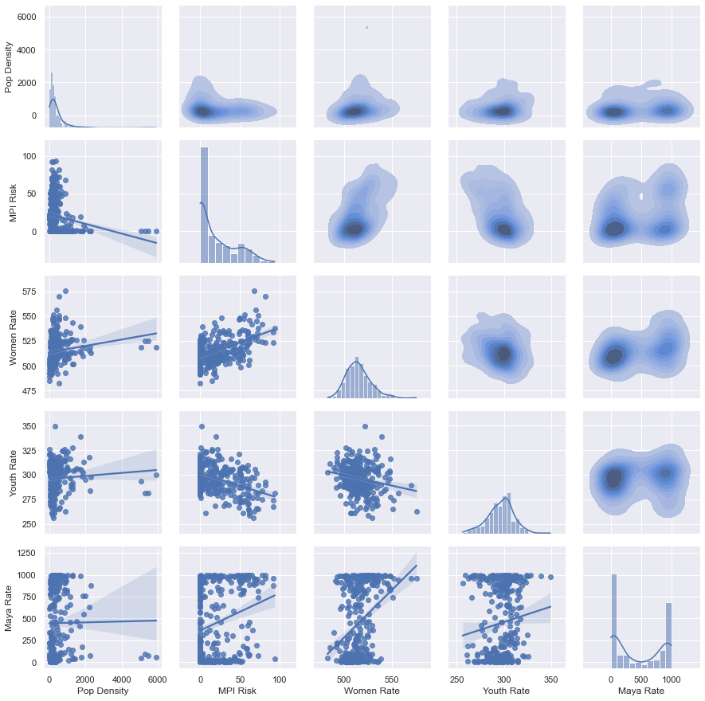

# Preliminary Analysis of Guatemala Spatial Data

    
<b>Learn more about how this report was generated</b>

This report was generated using a Jupyter Notebook, available as an ESRI application add-on with a Creator Account. A version of this notebook with the code used to generate it is available upon request.

This report details an initial analysis of currently available spatial data in Guatemala. The purpose of this analysis is to better understand the data available, limitations of the data, and the types of questions these data may help us answer for stakeholders. This report also models a repeatable, generalized process for data analysis.

The report begins with an initial exploration of the available data and the relationships between key metrics ("metrics" is used in this report to describe any measure of concern, such as population density or youth rate). 

Next, we address the following key question for the USAID Guatemala mission as a whole and for each Technical Office and La Ruta collaborative:

**"Are we conducting activities in municipalities that show high measures for the social, economic and environmental metrics we seek to influence?"**

## Exploratory Data Analyses

Exploratory data analyses are conducted to ensure data quality, understand key parameters of the data, and explore relationships between data. Here we describe the data included in this analysis, the process of preparing the data, the rationale for selection of primary metrics, and explore relationships between key metrics.

### Available Data

Data for this analysis can be accessed with an ESRI Viewer account on the [Guatemala Mission's ArcGIS Online site](https://usaidguatemala.maps.arcgis.com/home/index.html). Data are accessible under Content > My Organization. 

From the available feature layers we have selected layers related to municipal politial boundaries, activities and their locations, demographics including population, youth rate, women rate, Maya rate, and the Migration Potential Index (MPI). We have not included any sensitive data including data on returnees, apprehensions, or homicides due to their sensitivity. However, these data may be included in future analyses as needed.

### Data Preparation

To simplify analysis, key metrics from each dataset with muncipality-level data were joined based on the muncipality ID field (`Codigo1`) to create a "flat-file" with all metrics indexed by muncipality. This format can be shared via any spreadsheet software to allow analysis by stakeholders without a GIS. 

Next, a limited set of metrics were selected to simplify analysis. We have selected data from the year 2018 as this year provides the most comprehensive set of metrics for a single year and includes the most recent available census data. These data were then joined to a shapefile of municipality boundaries to allow for plotting with maps.

The High, Medium and Low MPI metric, which represent the proportion of households in a muncipality scoring high, medium or low on the MPI, will be highly correlated for each municipality. To focus the analysis, we will combine these three metrics by summing the High and Medium MPI measures to calculate an 'MPI Risk' metric; we drop the 'Low MPI' metric.

<iframe height=350  width=100% src='assets/muni-table.html'></iframe>

A second dataset was created to capture the location of activities. In this dataset, each activity/municipality combination is a record. The Technical Office of the activity and whether the activity is a part of La Ruta collaborative is also included. 

<iframe height=350  width=100% src='assets/activities-table.html'></iframe>

Below, we use a pair plot to explore distributions of each metric and relationships between them. The diagonal shows the distribution of each metric, the lower left and upper right show relationships between pairs of metrics with regression plots and kernel density plots, respectively.

Here we can see that Women Rate and Youth Rate are both normally distributed across all municipalities. The Maya rate shows that many municipalities have a very low rate (near 0%), while some municipalities have high rates (near 100%). Very few municipalities have a rate in between, which suggests high stratification and racial isolation.

As we would expect based on our understanding of the drivers of migration, municipalities with higher women rates and Maya rates also have a higher migration potential. However, youth rate appears to be negatively correlated with migration potential, contrary to expectations.

## Analysis

Data analysis is an iterative process requiring collaboration between the analyst and the stakeholder, where the stakeholder represents the entity for which the analysis is conducted.

We recommend following a cycle of the following steps iteratively throughout the analysis:
1. Pose a question
2. Co-develop an evaluation plan
3. State expectations
4. Evaluate
5. Communicate
6. Refine and repeat

Steps 1-3 are best completed as a collaboration between the analyst and the stakeholder. The analyst can help the stakeholder refine their question to one that is answerable with available data and analysis techniques. Co-developing the evaluation plan helps avoid miscommunication. Stating expectations of the analysis before the analysis is conducted can serve as a type of hypothesis and also helps the analyst consider the best way to communicate analysis results.

The analyst will then complete the evaluation based on the evaluation plan and prepare to communicate insights developed from the analysis. Insights should be commuicated to relevant stakeholders. 

Invariably, the analysis will lead to more questions or a need to refine the initial question. Repeat the process until a satisfactory answer is achieved or resources run out.

### Motivating Question

*Analyses should begin from a question or hypothesis, rather than from the data. While understanding which data are available and the limitations of those data is important, the data available today should not be a deterent from asking the questions that need answers. Further, data is unlikely to provide insights by itself. It is the analyst's job to utilize the data to attempt to answer stakeholder questions while also counseling stakeholders on the limitations of the analysis.*

 The question motivating this analysis, repeated from the introduction, is as follows:

**"Are we conducting activities in municipalities that show high measures for the social, economic and environmental metrics we seek to influence?"** 

We will attempt to address this question overall, for each Technical Office, and for La Ruta collaborative.

### Evaluation Plan

*The evaluation plan should state succinctly how the data will be manipulated and the plan for communicating insights through maps or data visualizations. Specifying the evaluation plan up front helps focus and direct the evaluation and can help identify when the data and analytical techniques available are not sufficient to answer the question posed. Refine the question if needed in this case.*

For each analysis, we will create one map per metric showing a choropleth of the metric by municipality and a variable-sized marker indicating the number of activities located within the municipality. In addition, we will show a scatter plot relating the number of activities in a muncipality with each metric measure.

### Expectation

*The expectation should describe what the stakeholder expects the data to show following the evaluation. Stating the expectation before the evaluation serves as a lightweight hypothesis and can stakeholders think through what a positive or negative result implies. This is also an opportunity to capture any limitations of the data or the analysis which might explain why the results of the analysis do not match the expectation.*

We expect that the number of activities in any municipality is positively correlated with any metric for which the Technical Office is attempting to influence through its programming. For example, we expect that the count of all activities, regardless of Technical Office, increases as the MPI increases due to the focus on the Root Causes Strategy (RCS). This would corroborate the assertion that the Mission is geographically targetting resources strategically.

If this expectation does not hold, it may be for a number of reasons, including:
* data at the municipal level do not appropriately capture the targetting of activities; activities are targetted at communities, households or some other sub-municipal scale
* 2018 data do not reflect the state of the world in which activities were initially targetted
* the activity data we have shows the coverage for the previous CDCS; targetting has changed 
* the number of activities in a municipality is a poor proxy for geographic targetting, better might be dollars invested and better still economic impact of dollars invested
* activities are not targeted strategically

### Results

*Results communicates the findings of the analysis. In many cases, we recommend including a summary of results at the beginning of any report to allow decision makers to quickly digest the information. Additional detail can be provided after the summary of results for those who need to or prefer to know the details of the analysis.*

Here we present the results of the analysis overall, for each Technical Office, and for La Ruta collaborative.

#### Overall

Here we present the results for all activities regardless of technical office. Due to the RCS, we focus on MPI Risk (the proportion of households with medium or high potential of migration) as the metric for which the Mission as a whole is interested in targetting.

From this map we can clearly see that USAID is targetting activities in higher numbers in the Western Highlands where MPI Risk is generally higher than other areas.

<iframe height=350 width=100% src='assets/overall-mpi-map.html'></iframe>

---
However, as we can see from a scatterplot relating the MPI Risk and number of activities for each municipality, the relationship is not strong. MPI Risk only explains 8% of the variability in number of activities for each municipality (R-squared of the ordinary least squares regression equals 0.085).

<iframe height=400 width=100% src='assets/overall-mpi-chart.html'></iframe>

---
Given the apparent disagreement between the map and scatterplot, we revise our motivating question to focus on departments instead of municipalities: 

**"Are we conducting activities in departments that show high measures for the social, economic and environmental metrics we seek to influence?"**. 

Indeed, we do see a stronger relationship between the average MPI score within a department and the number of activities taking place within that department. We will use departments, rather than municipalities for our analysis by Technical Office.

<iframe height=350 width=100% src='assets/overall-mpi-dept-chart.html'></iframe>

---

#### Democracy & Governance Office

<iframe height=350 width=100% src='assets/DGO-map.html'></iframe>

<iframe height=350 width=100% src='assets/DGO-chart.html'></iframe>

---

#### Economic Growth Office

<iframe height=350 width=100% src='assets/EGO-map.html'></iframe>

<iframe height=350 width=100% src='assets/EGO-chart.html'></iframe>

---

#### Health & Education Office

<iframe height=350 width=100% src='assets/HEO-map.html'></iframe>

<iframe height=350 width=100% src='assets/HEO-chart.html'></iframe>

---

#### PEPFAR

<iframe height=350 width=100% src='assets/PEPFAR-map.html'></iframe>

<iframe height=350 width=100% src='assets/PEPFAR-chart.html'></iframe>

---

#### La Ruta

Here we filter activities that are included in La Ruta collaboration, which include 'Nexos Locales Project', 'Community Roots Project', 'Communities Leading Development', 'Peacebuilding Project', 'Feed the Future Guatemala Innovative Solutions for Agricultural Value Chains Project', and 'Puentes Project'. 

<iframe height=350 width=100% src='assets/La Ruta-map.html'></iframe>

<iframe height=350 width=100% src='assets/La Ruta-chart.html'></iframe>

---

### Discussion

*In the discussion section we provide additional insights including counsel on any limitations of the analysis and its conclusions. This is a good opportunity to revisit the expectation stakeholders had of the analysis and discuss how the results differ, if they do, and why that might be.*

As we can see from these scatter plots, each Technical Office and La Ruta collaborative is generally targeting the departments that show high measures for the metrics used in this analysis. This relationship holds less strongly at the municipal level.

The departments with the most activities are also those known to have the highest rates of returnees over the past few years. The table below shows the top 5 departments by total number of activities.

<iframe width=100% height=200 src='assets/top-departments-table.html'></iframe>

If IPs typically work regionally within Guatemala, this suggests that IPs working in a region might be more effective by targeting in which municipalities they function. However, it may also be the case that IPs are targeting their level of effort at some sub-municipal level. Follow up conversations with IPs can help discern if there is truly an opportunity for more specific geographic targeting.

#### Future Directions

For further analysis, we recommend seeking a more direct measure of impact than the number of activities. Dollars invested might provide a more interesting comparison. However, actual return on dollars invested would be best, if it can be measured in a meaningful way.

Further, we recommend analyzing geographic targeting across multiple spatial scales, ideally including sub-municipal scales. We may work with IPs to get a better sense of where they are targeting their efforts at the community or household scales. 

The MPI offers a field-based rapid survey for assessing the MPI Risk of a single household ([Appendix D](https://ebrary.ifpri.org/digital/collection/p15738coll2/id/133849)). This may be used by IPs for all or a sample of their beneficiaries. A systematic survey may also be conducted across high-priority departments or other geographic area of focus.

---

